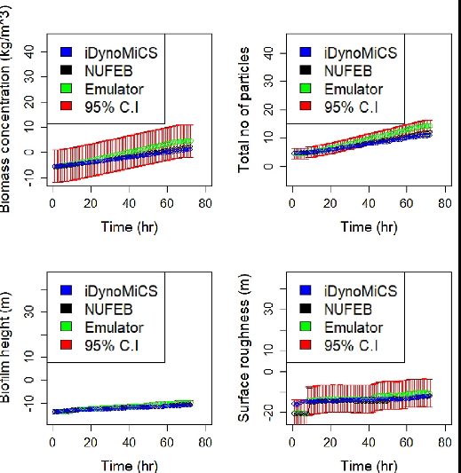

# Outline

* Wastewater treatment
* Modelling across scales
* Microscale modelling of complex bacterial community growth
* Statistical emulation of the microscale model
* Emulation-based calibration of a computationally expensive simulation model

# Wastewater treatment plants

* Wastewater treatment plants (WTPs) are a good example of a multi-scale open engineered biological system
* There are roughly $10^{18}$ individual bacteria in a typical plant
* Macro-scale characteristics of WTPs are the consequence of micro-scale features of a vast number of individual bacteria acting together in complex ecological communities
* The properties of cells at the microscale level dictate the behaviour of a WTP at the macroscale
* Need to model and understand the interaction of microbes at a fine scale to accurately capture macroscale responses
* Need to transfer this fine-scale information to the engineered macroscale process in a computationally efficient way

# Modelling across scales

{height=60%}

# Microscale modelling of bacterial community growth

{height=60%}

# Biological/mechanical modelling

* Each bacterial cell is an agent within an individual based model of cell growth, division, death and mechanical interactions
* First order growth kinetics, solved numerically using an explicit Euler scheme
* Growth rates depend on the nutrient environment of the agent, and nutrients are taken up from the fluid during growth
* Cell division occurs when cells reach a critical size --- stochastic elements in the division process
* EPS grows initially as a shell around appropriate cells, then excretes as a discrete particle/agent (placed randomly)
* Mechanical relaxation is required due to cell growth and division --- a discrete element method (DEM) is used, solving for each particle in the Lagrangian framework --- springs and dashpot model --- using LAMMPS
* The net force on each agent is the sum of contact, adhesion, and fluid forces

# Mechanics

{height=60%}

# Physical/chemical modelling

* Nutrient mass-balance --- advection--diffusion--reaction equation, for each nutrient, $S$:
$$\frac{\partial S}{\partial t} + \vec{U}\cdot\nabla S = \nabla\cdot(D_e\nabla S) + R$$
* $\vec{U}$ is fluid velocity, $D_e$ effective diffusion coefficient, and $R$ nutrient uptake rate
* Rectangular computational domain and discretisation
* Temporal derivatives forward Euler
* Spatial derivatives central finite differences
* Due to time scale separation between physical and biological processes, we typically solve to steady state within each biological time step

# Computational domain

{height=60%}

# Interaction of multiple bacterial species

{height=60%}

# Nutrient abundance and diffusion

{height=60%}

# Flocs and biofilms

{height=60%}

# Varying boundary conditions

{height=50%}

# Biofilm growth in a shear fluid flow

{height=60%}

# Deformation and detachment

{height=60%}

# NUFEB IB Models

## NUFEB open-source modelling software

* The NUFEB model is free open source software on GitHub, built on top of LAMMPS: https://github.com/nufeb/NUFEB
* Microbes and nutrients: many microbial species, gas and liquid nutrients
* Biological features: Monod-based growth, energy-based growth, cell division, EPS production, cell death
* Chemical features: pH, gas-liquid transfer, thermodynamics
* Physical features: nutrient mass balance (diffusion), EPS adhesion, shear force, contact force, viscous force

# Scaling up

* The model can run up to order $10^6$ bacteria
* Typically run for cubic volumes with side 200um (though particle numbers are the main limiting factor)
* Collaboration with Oak Ridge National Laboratory (ORNL, www.ornl.gov) on parallelisation of the code to run effectively on the ORNL supercomputer (and also some wet lab work for model validation)
* Regardless, difficult to scale to more than $10^8$ or $10^9$ bacteria in practice
* Still a long way off the $10^{18}$ bacteria in a typical full-scale WTP...
* But perhaps not so far away from a reasonable "representative volume"...

# Statistical emulation of complex computer models

* The micro-scale model is very computationally intensive --- approx 1 CPU day to simulate 5 real days
* There now exists a large literature on the use of statistical model *emulators* in the design and analysis of computer experiments
* Emulators essentially provide a fast approximate surrogate for the true model, with properly quantified uncertainty, but have a number of different possible uses, including:
1. History matching (finding inputs which give output consistent with data)
2. Calibration (finding parameter settings most consistent with data)
3. Model validation (deciding whether the model is a good fit to reality)
4. Design (finding inputs leading to a desirable output)

# Gaussian process emulation

* A GP is a probability distribution on functions defined so that the marginal distribution of any finite number of points always has a multivariate normal (MVN) distribution
* Points close together in input space are typically more highly correlated than points far away
* Stationary GPs are defined by a *covariance function* --- many different possible choices --- a Gaussian kernel is popular
$$
\operatorname{Cov}[f(\mathbf{x}),f(\mathbf{x}')] = K(\mathbf{x},\mathbf{x}') = \sigma^2\exp\left\{-\left(\frac{\Vert \mathbf{x}-\mathbf{x}'\Vert_2}{r}\right)^2\right\},
$$
containing two parameters: an asymptotic variance, $\sigma^2$, and a correlation length scale, $r$.
* A GP conditioned on observations is also a GP (*Kriging*)

# Sequential updating of a GP emulator

{height=60%}

# Sequential updating of a GP emulator

{height=60%}

# Sequential updating of a GP emulator

{height=60%}

# Sequential updating of a GP emulator

{height=60%}

# Sequential updating of a GP emulator

{height=60%}

# Sequential updating of a GP emulator

{height=60%}

# Samples from a GP posterior distribution

{height=60%}

# Samples from a GP posterior distribution

{height=60%}

# Samples from a GP posterior distribution

{height=60%}

# Design of computer experiments

* To build a "good" emulator, we want residual uncertainty to be small. In 1d this is easy, but in higher dimensions we need to choose *design points* to *fill space* efficiently so that there aren't big gaps in parameter space for which we don't have a simulator run
* The naive approach to this problem is to construct a *Cartesian product design* where many levels of each variable are considered in turn, but this approach becomes unworkable in more than 2 or 3 dimensions
* *Latin hypercube designs* (LHDs) are a good way to choose design points to fill space in an efficient way
* In more than 2 dimensions, Cartesian product designs (naive parameter scans) are a very inefficient way of covering the design space, and LHDs are much better.

# A 2D Latin hypercube design

{height=60%}

# Statistical emulation of the microscale model

* We typically emulate important univariate summary statistics arising from the analysis of the raw computer model output (eg. Floc diameter, floc mass, biofilm height, surface roughness, community diversity index, ...) based on numerous inputs (covariates)
* Consider output $y$ for input $\mathbf{x}$ as a deterministic function
$$y = f(\mathbf{x})$$
* Outputs $y_i$ at $n$ design points $\mathbf{x}_i$ statistically modelled as
$$ \mathbf{y} \sim \mathcal{N}(\mathsf{H}\boldsymbol{\beta},\mathsf{A}) $$
where $\mathsf{H}$ is a design matrix where the $i$th row of $\mathsf{H}$ is a (deterministic) function of $\mathbf{x}_i$, and $\mathsf{A}$ is the matrix of covariances determined by the Gaussian kernel described earlier

# Multivariate emulation

* Univariate emulation ignores correlation between multiple outputs --- often better to jointly model
* Covariance matrix for $p$ outputs a $p\times p$ matrix $\Sigma$
* Assuming separability of the two covariance matrices, we get a matrix normal distribution for $n\times p$ output matrix $\mathsf{Y}$
$$ \mathsf{Y} \sim \mathcal{MN}(\mathsf{H}\mathsf{B},\mathsf{A},\Sigma) $$
* ie. $\operatorname{Var}(\boldsymbol{\operatorname{vec}} Y) = \Sigma \otimes \mathsf{A}$
* Important to include a (linear/polynomial) model for the mean structure, and just use a GP for residual variation

# Dynamic emulation

* The simulation model is a time evolving dynamical system
* Often desirable to emulate dynamical behaviour over time steps (much larger than the simulation time steps)
* Regard the simulator as a dynamic function
$$ \mathbf{y}_t = f(\mathbf{x}_t,\mathbf{y}_{t-1}) $$
where $\mathbf{y}_t$ is a state vector and $\mathbf{x}_t$ represents the model inputs at time $t$
* Statistically model and emulate $f(\cdot,\cdot)$
* Again, much better to incorporate a (linear) model for the mean and use a GP for residual variation

# DLMGP emulator

* A dynamic linear model (DLM) provides a sensible framework for dynamically modelling the mean behaviour
* Using a GP for residual variation gives a DLMGP
\begin{align*}
y_t &= H_t\theta_t + e_t,\quad e_t \sim N(0, \nu_t \mathfrak{R}), \\
\theta_t &= G\theta_{t-1} + w_t,\quad w_t \sim N(0,W),
\end{align*}
where $H_t$ is a dynamic covariate regression matrix, and $\mathfrak{R}$ is a GP correlation matrix
* This model can be fit to data and used for prediction using a combination of DLM and GP theory

# Emulation results

{height=60%}

# Emulation results

{height=60%}

# Multivariate Bayesian calibration model

* Existing (simpler) IB model, iDynoMiCS, already validated against a benchmark biofilm modelling problem
* NUFEB model more sophisticated, more scalable, incorporates more mechanisms, etc., but should be able to broadly replicate the behaviour of iDynoMiCS within its range of validity
* Not an exact correspondance between the models, so can't just "copy" the parameters, but can _calibrate_ the NUFEB model against iDynoMiCS output, $\mathbf Z_t$

\begin{align*}
\mathbf
Z_t(.) &= \operatorname{vec}\mathbf Y_t(\eta) + \boldsymbol\xi_{zt},\quad \boldsymbol\xi_{zt} \sim N(\mathbf 0, \Sigma_z) \\
\mathbf Y_t(\eta) &= \mathbf H_t(\eta)\boldsymbol\Theta_t + \boldsymbol\epsilon_t,\quad \boldsymbol\epsilon_t \sim MN(\mathbf 0, \Sigma_t, \mathfrak{R}) \\
\boldsymbol\Theta_t &= \mathbf G\boldsymbol\Theta_{t-1} + \boldsymbol\omega_t,\quad \boldsymbol\omega_t \sim MN(\mathbf 0, \Sigma_t, W_t)
\end{align*}

Embed everything in an MCMC loop to estimate $\eta$

# Calibrated models

{width=45% height=70%} {width=45% height=70%}

# Summary and conclusions

## General

* Spatially explicit IB models are an invaluable tool for understanding the stochasticity and heterogeneity of complex biological system behaviour
* Developing realistic models of open biological systems in active fluid environments is challenging but possible
* Statistical emulators have many applications in the design and analysis of complex computer experiments
* Emulators are a particularly effective tools for calibrating the parameters of computationally expensive simulation models

# Acknowledgements

* EPSRC
* Newcastle University
* Northumbrian Water
* Mott MacDonald
* Oak Ridge National Laboratory

.

.

.

The NUFEB project involved many investigators and researchers at Newcastle University, and was led by *Prof Tom Curtis* (Engineering)

# References

* Oyebamiji, O. *et al.* (2017) Gaussian process emulation of an individual-based model simulation of microbial communities, *Journal of Computational Science*, **22**: 69-84.
* Oyebamiji, O. *et al.* (2018) A Bayesian approach to modelling the impact of hydrodynamic shear stress on biofilm deformation, *PLoS ONE*, **13**(4): e0195484.
* Oyebamiji, O. *et al.* (2019) Bayesian emulation and calibration of an individual-based model of microbial communities, *Journal of Computational Science*, **30**: 194-208.
* Gogulancea, V. *et al* (2019) Individual based model links thermodynamics, chemical speciation and environmental conditions to microbial growth, *Frontiers in Microbiology*, **10**:1871.

.

https://research.ncl.ac.uk/nufeb \hfill  https://darrenjw.github.io/

