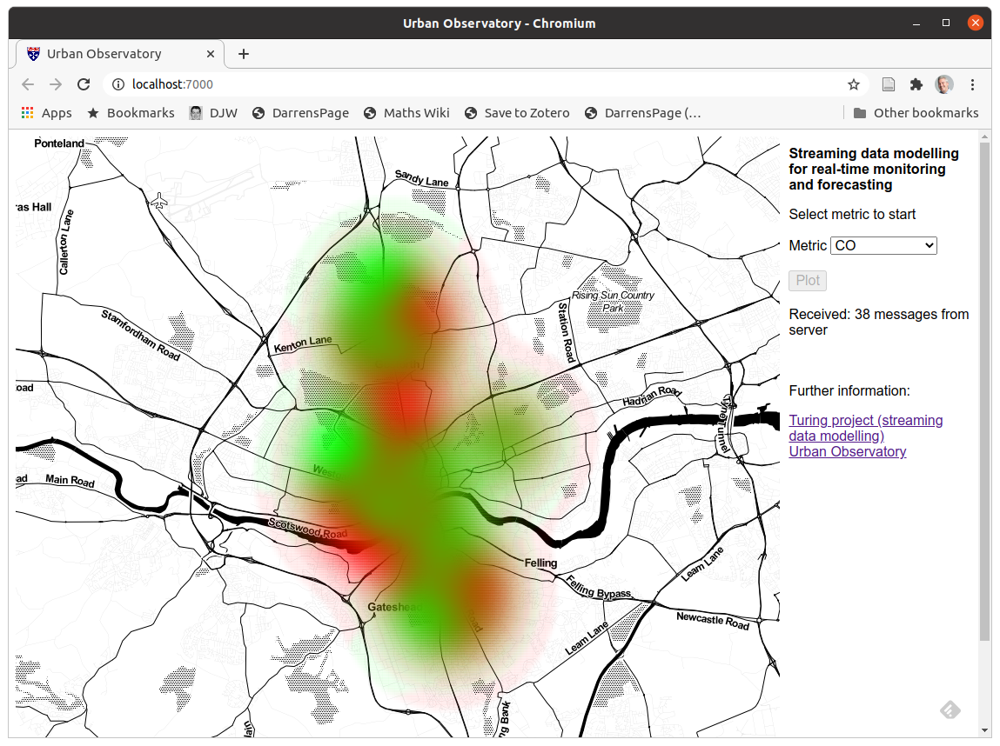

# Outline

* What is streaming data?
* How to think about streaming data
* Computational models for streaming data
* Statistical models for streaming data
* An example: nowcasting urban air pollution
* Streaming Gaussian processes

# Big data

* We live in the age of data...
* Small cheap ubiquitous computing devices, cheap storage
* Fast communication over the internet 
* *Blah, blah, ...*
* **Big data** is apparently about '**V**'s:
    * Volume
	* Variety
	* **Velocity**
	* (Veracity), ...
* **Fast data** is all about dealing with newly acquired data in near real-time
* Data engineers are increasingly relying on *streaming data architectures* for managing, routing, analysing and processing of fast data

# Streaming data applications

* Streaming voice and video applications
    * Zoom, Netflix, YouTube, etc.
	* Typically streamed directly *over the internet* to your display
	* Even if the video is downloaded to local storage, it is still *streamed* from storage and decompressed on-the-fly for real-time viewing - the entire video is never fully decompressed in RAM - not just about moving data over the internet
* Real-time financial market trading data
    * Automated trading systems
	* Decision support for human traders
* On-line processing (and compression) of scientific experiments
    * Biological sequencing technologies
	* Particle collider experiments
	* Large astronomical surveys (eg. SKA)
* Real time sensor network data for continuous monitoring
    * Traffic (and pollution) monitoring, weather forecasting, ...

# Historic streaming data technology: Unix pipes!

* Unix-based shell commands can provide a simple streaming data system, based on the assumption that the units of your data stream correspond to single lines of a text file
    * Many Unix programs are designed to read lines one-at-a-time from *standard input*, do some processing, and write lines one-at-a-time to *standard output*.
* Standard output can be *piped* from one command to the standard input of another
    * The processes run concurrently - the second program in the pipeline does not wait for the first program to complete before starting
* `myMCMC 1000000 | burn 1000 | thin 100 > chain.csv`
    * The full 1000000 iterations never exist either in RAM or mass storage
* Nice idea, but unsuitable for complex (especially quantitative) data and pipelines
	
# Newcastle Centre for Data (NUCoRE)

* A University research centre focused on data
* Seven cross-cutting themes:
    * biomedical informatics
    * data for manufacturing
    * data visualisation
    * spatial analytics
    * **streaming data modelling**
    * text in a digital age
    * regulation of data driven technologies
* [`www.ncl.ac.uk/research/data/`](https://www.ncl.ac.uk/research/data/)
* Opportunity to run events in theme areas - ideas for streaming data events to me and AG

# Turing Fellow project

## Streaming data modelling for real-time monitoring and forecasting

(with A Golightly, S Heaps, Y Huang, ...)

* Computational architecture and infrastructure
* Statistical methodology and algorithms

## Applications
* Urban Analytics (The Urban Observatory - eg. pollution)
* Healthcare (Wearables/neuroscience)

## Links
* https://urbanobservatory.ac.uk/
* https://www.turing.ac.uk/research/research-projects/streaming-data-modelling-real-time-monitoring-and-forecasting

# Flood-PREPARED

## Predicting Rainfall Events by Physical Analytics of REaltime Data

(with S Heaps, K Wilson, S Johnson, Y Yu, ...)

* Real-time short-term high-resolution spatio-temporal rainfall modelling, synthesising areal weather radar and point rain gauge data
* Near real-time emulation of and data assimilation for a hydrodynamic urban flood model
* Hooked up to traffic monitors, CCTV feeds, social media sources, etc., all live streaming, for the development of an emergency decision support system for Newcastle

# Streaming data architecture

## Fundamental concepts
* A *stream* is a (possibly infinite) sequence of values of a given (potentially complex) data type, with a definite order
* The stream is accessed one value at a time, and processing is done incrementally, triggered by the arrival of each value
* Typically only *one pass* over the data is possible
* Streams are connected together in a DAG called the *flow graph*

## Software libraries and frameworks
* *Storm*, *Heron*, *Spark streaming*, *Akka streams*, *Flink*, (*Kafka*) are well-known examples of streaming data frameworks
* Frameworks are often run on the *JVM*, built in languages with good support for **functional programming** (FP), such as *Scala*, and rely to a greater-or-lesser extent on FP principles such as *functional reactive programming* (FRP)

# Functional models of streaming data

* A key streaming data processing abstraction is a pure **function**:
$$h: \mathcal{X} \times \mathcal{Y} \longrightarrow \mathcal{X}$$
```
advance: (State, Observation) => State
```
combining current world knowledge (encapsulated in a `State`) together with the latest observation to get an updated world view

* Then given $x_0\in\mathcal{X},\quad \mathbf{y} \in \mathcal{Y}^{\mathbb{N}}$
```
s0: State, sObs: Stream[Observation]
```
we transform the stream of observations $\mathbf{y}$ to states $\mathbf{x}\in\mathcal{X}^{\mathbb{N}}$:
```
sState: Stream[State] = sObs.scan(s0)(advance)
```
via successive application of $h$.

# Stream transformation

Streams are *functors* (and in fact, *comonads*), since they `map`:
```
  Stream[A].map[B](f: A => B): Stream[B]
```
The `scan` operation, sometimes called `scanLeft`, has signature:
```
  scanLeft[B](init: B)(advance: (B, A) => B): Stream[B]
```
For example:
```
val naturals = Stream.iterate(1)(_ + 1)
// 1, 2, 3, 4, ...
val evens = naturals map (_ * 2)
// 2, 4, 6, 8, ...
val triangular = naturals.scan(0)(_ + _).drop(1)
// 1, 3, 6, 10, ...
```

# State-space modelling

In state-space modelling, we have a

* forward model: $X_t | x_{t-1} \sim f(x_t|x_{t-1})$ or `f: X => P[X]`
* and observation model: $Y_t|x_t \sim g(y_t|x_t)$ or `g: X => P[Y]`

where `P[_]` is a suitable *probability monad*.

For *filtering* we typically think in terms of predict-update steps:

* $p(x_{t-1}|\mathcal{Y}_{t-1}) \rightarrow p(x_t|\mathcal{Y}_{t-1})$ or `predict: P[X] => P[X]`
* $p(x_t|\mathcal{Y}_{t-1}) \rightarrow p(x_t|\mathcal{Y}_t)$ or `update: (P[X],Y) => P[X]`

`predict` is monadic `flatMap` (or `>>=`) with `f`, and `update` is probabilistic *conditioning* via `g`

Streaming: `advance = update compose predict'` where `State = P[X]` - eg. one step of a Kalman or particle filter

# Composable functional models of on-line algorithms and PPLs

* Once we start to think about filtering in terms of operations involving probability monads, it becomes easier to think about how to make models and algorithms composable and scalable, and about the connection to *probabilistic programming* and monadic *probabilistic programming languages* (PPLs)

* Possible to think about all of the standard models and algorithms within this framework: Kalman filters (regular, extended, unscented, ensemble, ...), particle filters (bootstrap, SIR, auxiliary, twisted, ...)

* Simultaneous estimation of (static) parameters and (dynamic) state still problematic: augmented state, Lui & West, Storvik filters, particle learning/practical filters, ... Also on-line (windowed) versions of PMCMC, IBIS, SMC${}^2$, ...

# POMP models

* Classical SSMs assume that the data are on an regular equispaced time grid, so that the state evolution model $f(x_t|x_{t-1},\theta)$ represents a single time step of the process
* Many sensors and devices do not generate data on a regular grid, either by design, or due to crashes/reboots creating large gaps of missing values, pushing observations onto a *misaligned grid*, or changes in sampling frequency, etc.
* **Partially observed Markov process** (POMP) models generalise classical SSMs in two important ways:
    * The state evolution model formulated in *continuous time*, and is described by a transition kernel $f(x_{t+t'}|x_t,t',\theta)$
	* It is not required that the transition kernel can be *evaluated* --- only that the state process can by stochastically *simulated* forwards in time

# On-line filtering of POMP models

* The "bootstrap" particle filter is a "likelihood free" algorithm for sequentially computing the filtering distribution of a POMP model (for fixed $\theta$):
$$
\pi(x_t|\mathcal{Y}_t),\ \text{ where } \mathcal{Y}_t \equiv \{y_s|y_s\in\mathcal{Y},s\leq t\}
$$
* Although it is typically presented in discrete time, it works fine for continuous time processes observed discretely at irregular times

* **Law \& W (2018)** *Composable models for online Bayesian analysis of streaming data*
    * https://doi.org/10.1007/s11222-017-9783-1

# What makes an algorithm "on-line"?

* Not all streaming data applications are about time series
* Many are just about analysing data based on a single pass
* Almost any statistical algorithm can be expressed in the form of a streaming data algorithm
* All of the data observed so far can be embedded in the *state*, and any analysis whatsoever of the data can be restarted from scratch with the arrival of each new observation!
* We wouldn't consider such an analysis to be *genuinely* on-line
* We typically assume that the "size" of the state is bounded, and that the "complexity" of the *advance* step has bounded expectation

# Example application: pollution monitoring

## The Urban Observatory

* The largest set of publicly available real time urban data in the UK --- web API, and also a "websocket" for real time data
* Temperature, rainfall and air quality sensors around the city
* Rainfall radar data
* *Multivariate*, *spatial*, *temporal*, *irregularly observed*, *mixed modality* (eg. point and areal)

## Pollution mapping in real time

* Pollution monitors are various (fixed) locations around the city
* Measurements every few minutes from every sensor, but not on a fixed grid, and not temporally aligned across sensors
* Would like to "nowcast" a spatially continuous map of pollution levels across the city, updated with each new observation

# Gaussian process modelling

* GPs have the property that any finite number of points are jointly multivariate normal (MVN), with a covariance matrix determined by a kernel
* Use MVN theory to get the conditional distribution of unobserved values given observations
* Two common parametrisations of the MVN (dual formulations), with different trade-offs:
1. Use the *covariance* matrix
    * Makes marginalisation easy, but conditioning expensive
2. Use the *precision* matrix
    * Makes conditioning easy, but marginalisation expensive

# MVN marginalisation and conditioning

$$
\binom{X}{Y} \sim N\left\{\binom{\mu_X}{\mu_Y}, \begin{pmatrix} V_{XX} & V_{XY} \\ V_{YX} & V_{YY} \end{pmatrix}\right\} = N\left\{\binom{\mu_X}{\mu_Y}, \begin{pmatrix} Q_{XX} & Q_{XY} \\ Q_{YX} & Q_{YY} \end{pmatrix}^{-1} \right\}
$$

## Variance parametrisation
$$
X \sim N\{\mu_X,\ V_{XX}\}
$$
$$
(X|Y=y) \sim N\left\{\mu_X + V_{XY}V_{YY}^{-1}(y-\mu_Y),\ V_{XX} - V_{XY}V_{YY}^{-1}V_{YX}\right\}
$$

## Precision parametrisation
$$
X \sim N\left\{\mu_X,\ (Q_{XX}-Q_{XY}Q_{YY}^{-1}Q_{YX})^{-1}\right\}
$$
$$
(X|Y=y) \sim N\left\{\mu_X-Q_{XX}^{-1}Q_{XY}(y-\mu_Y),\ Q_{XX}^{-1}\right\}
$$

# Extending a GP precision matrix

To add a new data point to the precision matrix of a GP, use a $2\times 2$ block inverse:
$$
\begin{pmatrix}V & c \\ c^T & \sigma^2\end{pmatrix}^{-1} = 
$$
$$
\begin{pmatrix} V^{-1} + V^{-1}c(\sigma^2 - c^TV^{-1}c)^{-1}c^TV^{-1} & -V^{-1}c(\sigma^2-c^TV^{-1}c)^{-1} \\ -(\sigma^2-c^TV^{-1}c)^{-1}c^TV^{-1} & (\sigma^2-c^TV^{-1}c)^{-1} \end{pmatrix}
$$
and so
$$
Q_\text{new} = \begin{pmatrix} Q + \frac{c_\star c_\star^T}{\sigma_\star^2} & -\frac{c_\star}{\sigma_\star^2} \\ -\frac{c_\star^T}{\sigma_\star^2} & \frac{1}{\sigma_\star^2}\end{pmatrix}
$$
where $c_\star = Qc$ and $\sigma_\star^2 = \sigma^2 - c^Tc_\star$.

# GP point prediction

* For a new unobserved design point $x^\star$, let $k$ be the vector of covariances with the observed design points (and $\sigma^2$ the variance). Then (for a mean zero GP):
$$
(Y(x^\star)|Y=y) \sim N(k^TQy, \sigma^2 - k^T Qk).
$$
* Note that for a collection of new design points, $x_1^\star, x_2^\star,\ldots$, (eg. a grid of points of interest) and associated matrix of covariances with the observed design points, $K$, then the conditional expectation for the new vector of values is just
$Ky^\star$
where $y^\star = Qy$. 
* Similar tricks can give the point-wise variances.

# Toy example

\movie{\includegraphics[height=0.85\textheight]{truth}}{movie.mp4}

# Pollution nowcasting



# Scalable GP modelling

* As the number of observations, $n$, grows, the $n\times n$ covariance (or precision) matrix gradually becomes problematic, whether inversion is explicit or not
* Can subset or merge design points in more-or-less principled ways, or form some other sparse or low-rank approximation of the covariance (or precision) matrix
* There is also interest in learning GP hyperparameters (such as length scales) in an on-line fashion
* **Snelson and Ghahramani** - *Sparse GPs using pseudo-inputs*
    * http://www.gatsby.ucl.ac.uk/~snelson/SPGP_up.pdf
* **Bui et al.** - *Streaming sparse GP approximations*
    * https://arxiv.org/abs/1705.07131

# Summary

* The analysis and modelling of streaming data is becoming increasingly important
* Typical motivations:
    1. Sequential analysis of "live" data in (near) real time
    2. Analysis of large data-sets based on "one pass" methods
* There exist computational models and software libraries for working with streaming data in an efficient and robust way
* Functional (and reactive) programming languages and approaches are well-suited to working with (infinite) data streams
* Time series are a natural fit to streaming data models, but not all streaming data applications have a semantically important temporal aspect
* Many statistical models and algorithms can be adapted to a sequential context

# Links and references

## Links

* https://darrenjw.github.io/
* https://www.ncl.ac.uk/research/data/
* https://urbanobservatory.ac.uk/
* https://www.turing.ac.uk/research/research-projects/streaming-data-modelling-real-time-monitoring-and-forecasting

## Papers

* https://doi.org/10.1007/s11222-017-9783-1
* https://arxiv.org/abs/1908.02062

* http://www.gatsby.ucl.ac.uk/~snelson/SPGP_up.pdf
* https://arxiv.org/abs/1705.07131
